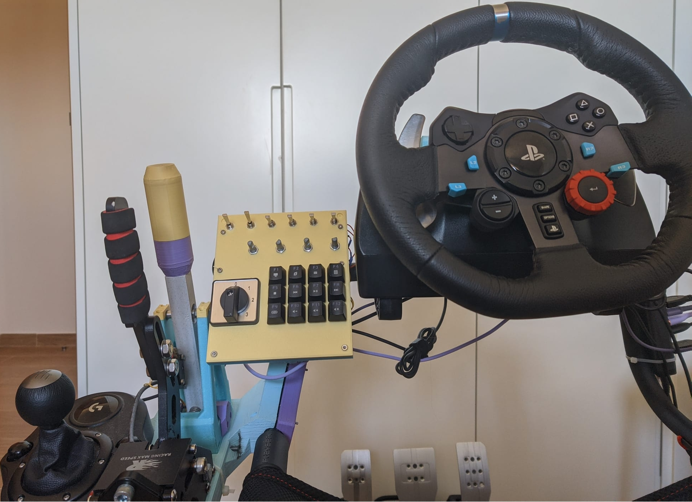
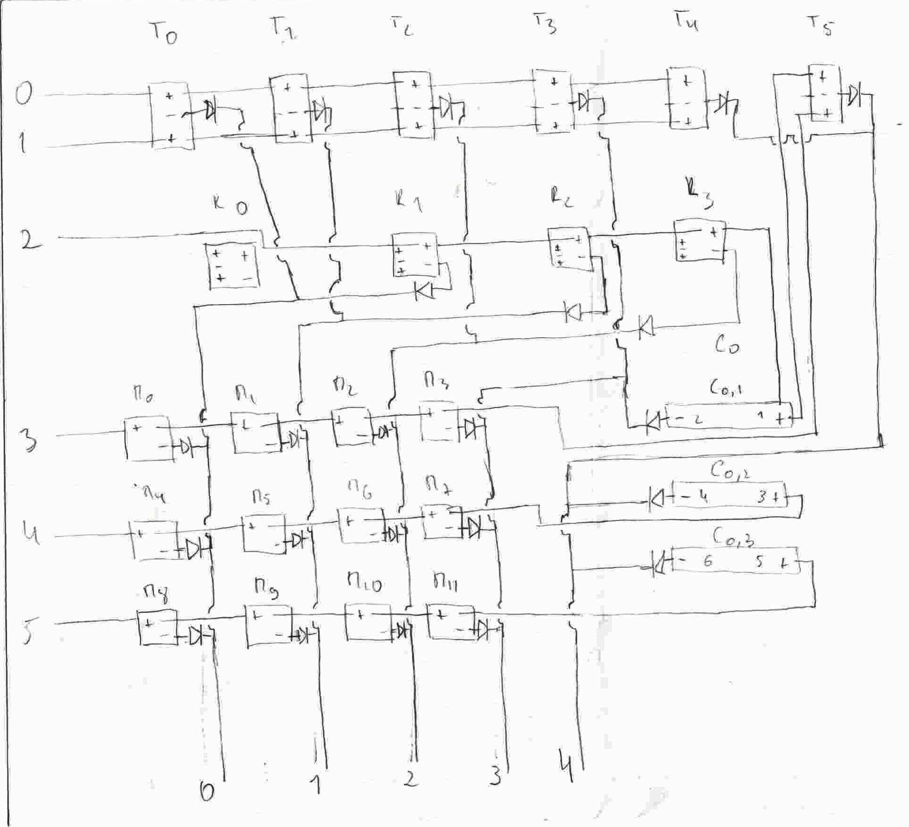
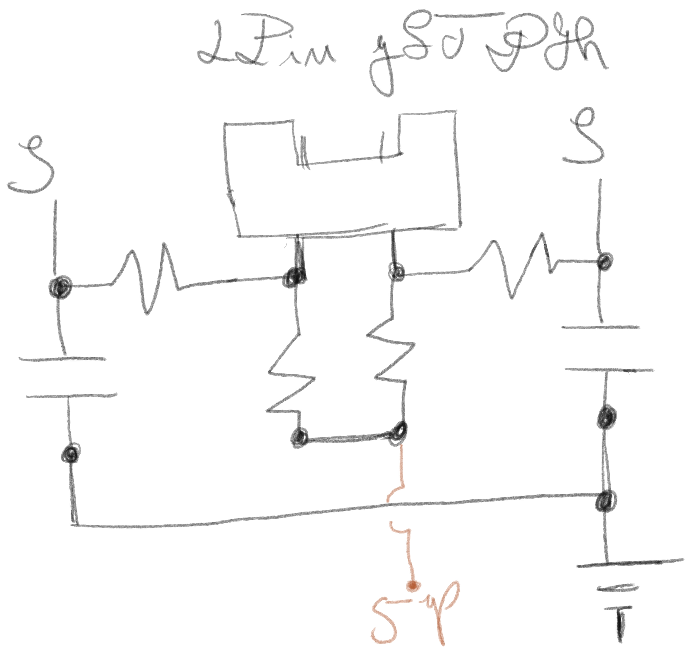
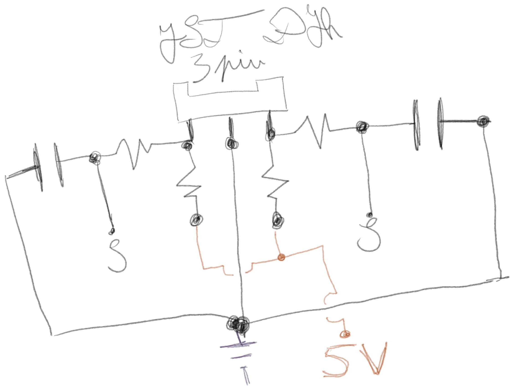
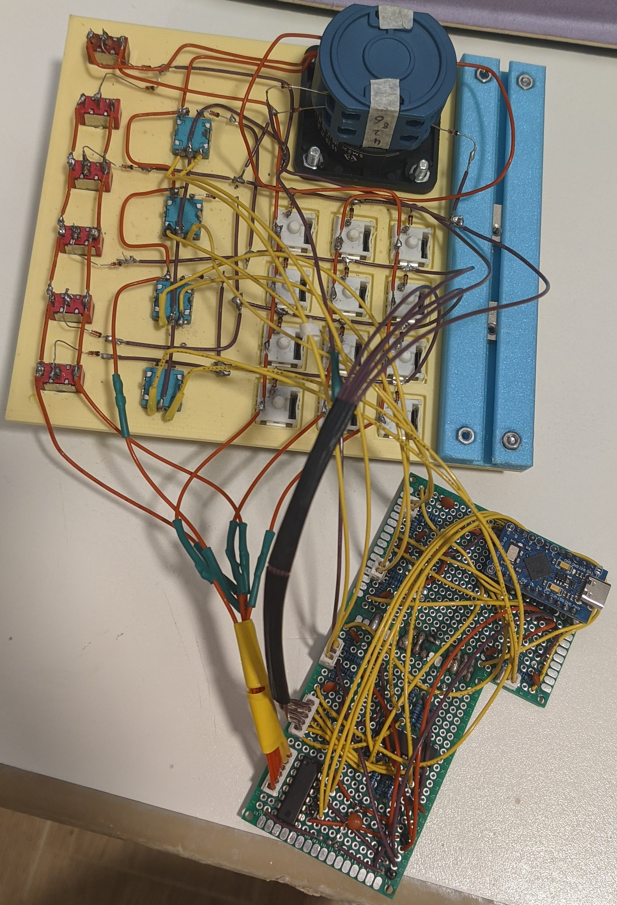
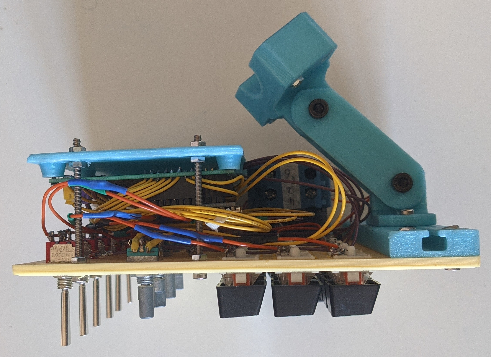
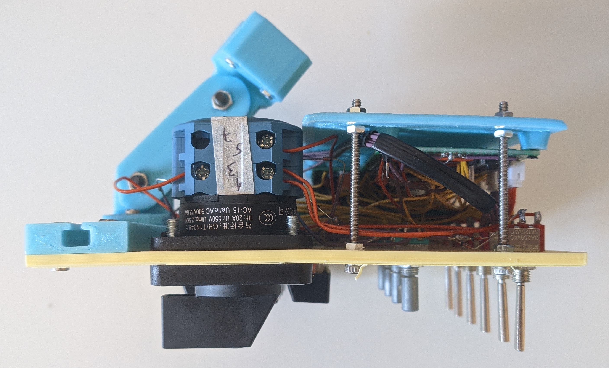
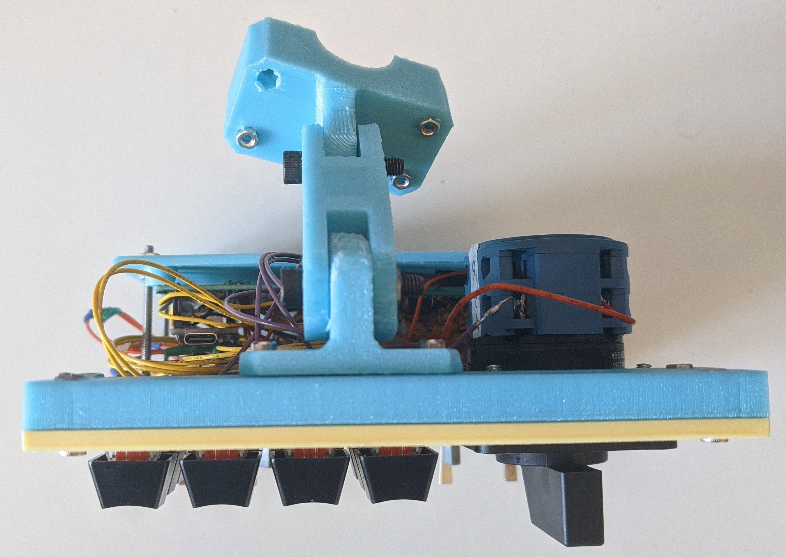
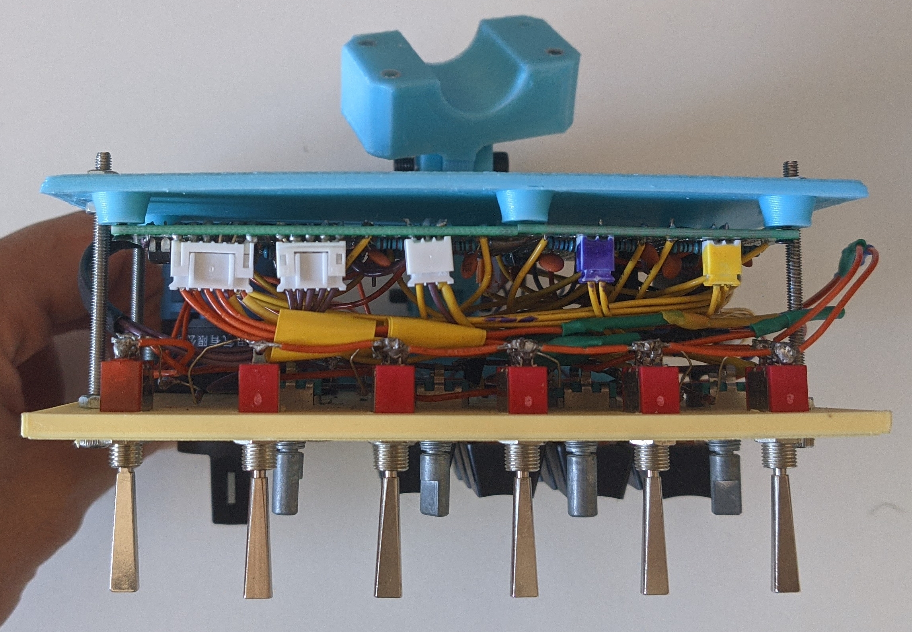

# ESBtnBox
Simple button box for simracing and other activities. This works but its still
an early phase and I hope to subject it to a great list of improvements from
polishing the 3D models to making the whole thing more compact.

# Components
## Electronics
| Part                                      | Quantity |
| ----------------------------------------- | -------- |
| Arduino Pro Micro (ATmega32u4)            | 1        |
| Female Headers for pro micro              | 24       |
| JST-PH Connectors (6 pin) male and female | 1        | [^1]
| JST-PH Connectors (5 pin) male and female | 1        |
| JST-PH Connectors (3 pin) male and female | 1        |
| JST-PH Connectors (2 pin) male and female | 3        |
| Perf boards 70mm x 500mm                  | 2        |
| 100nF Capacitors                          | 10       |
| 74HC595N Shift Register                   | 1        |
| 74HC165N Shift Register                   | 1        |
| 10k Ohm Resistors                         | 20       |
| 1N4148 diodes                             | 26       |
| Toggle Switches                           | 6        | [^2]
| Rotary Encoders                           | 4        |
| 2P LW26-25 series changeover switch       | 1        |
| MX switches (and keycaps I recon)         | 12       |
| Wiring and consumables                    | Lots     |

[^1]: I used 2mm pitch for these connectors, but they didn't really match the
pitch of the perf board I was using. Choosing other pitches wouldn't be a bad
idea.

[^2]: I used 4 On-Off-On switches and 2 MOM-Off-MOM switches. Permutate it
however you desire.

## Hardware
| Part            | Quantity |
| --------------- | -------- |
| M3 nuts         | 20       | [^3]
| M5 nuts         | 2        |
| M3x40mm         | 4        | [^4]
| M3x12mm         | 2        |
| M3x50mm         | 4        |
| M5x20mm         | 2        |
| M3 t-nut        | 2        |
| M2 Heat Inserts | 7        |
| M2x6mm          | 7        |

[^3]: 4 of these are optional: the ones on the outwards facing piece that connects 
to the playseat and the 2 top ones on the front plate

[^4]: 2 of these are optional: the ones on the outwards facing piece that connects
to the playseat structure.

## 3D printed parts
- Clamp: composed by the files `./3DModel/seatAttachement_screwSide.FCStd` and
`./3DModel/seatAttachement.FCStd`, the latter is the the one facing the seating
user and the first the one facing outwards
- Arm which is the file `./3DModel/arm.FCStd`
- T-slot which bolts to the front plate: `./3DModel/tSlot.FCStd`
- T-slot bracket which bolts to the t-slot and the arm: `./3DModel/tSlotAttachement.FCStd`
- Front plate where all the buttons are mounted to: `./3DModel/frontPlate.FCStd`
- Cover plate which where the "pcb" mounts and connects to the front plate: `./3DModel/pcbHolder.FCStd`
- Very simple knob for the rotary encoders: `./3DModel/knob.FCStd`

# Assembly
The assembly is straightforward, specially if you are the one that imagined it:
1. put the toggle switches into their through holes and bolt them
2. put the rotary encoders into their through holes and bolt them
3. insert the MX switches into their holes
4. bolt the changeover switch into its slot
5. wire the things according to the schematic. I started by doing the columns
and then the rows and left the rotary part of the encoders for the end. Crimp
the JSH-PH connectors on the rows, columns and rotary encoders
6. solder the components to the perf boards. I joined the 2 perf boards like the
images show
7. mount the back cover
    1. put the heat inserts into the back cover
    2. bolt the perf boards to the back cover
    3. drill holes on the front plate for the back cover holes. They go 7.5mm
    in from the front plate edges, 1.5mm below the toggle switches and are spaced
    apart by 45mm
    4. pass the M3x50mm bolts trough the front plate and put nuts holding them
    5. place nuts 8mm down from the tip on them
    6. connect the front plate electronics to the pcb
    7. place the back cover on the M3x50mm bolts and put nuts on it
8. bolt the t-slot 3D printed part tot he front plate and pass the t-nuts into it
9. place the t-slot attachement on the t-nuts. Leave them loose for later adjustments
10. heat insert the M5 nuts into the arm and the M3 nuts on inside part of the clamp
11. loosely assemble the arm
12. place the assembly on the playseat and clamp it down with the M3x40mm bolts
13. do the final adjustments and tighten everything down

## Schematics
Well, I'm not very well versed on KiCAD or eletronics design in general, so all
I have is the following hand drawings and pinouts. I will make something better 
at some point.

### Shift registers:
| Pro Micro Pin | 74HC595N Pin |
| ------------- | ------------ |
| 4             | 14           |
| 5             | 12           |
| 6             | 11           |
| GND           | 8            |
| GND           | 13           |
| 5V            | 16           |
| 5V            | 10           |
Put a capacitor on the 5V and common Ground

| Pro Micro Pin | 74HC165N Pin |
| ------------- | ------------ |
| 7             | 15           |
| 8             | 7            |
| 9             | 2            |
| 10            | 1            |
| GND           | 8            |
| GND           | 13           |
| 5V            | 16           |
Put a capacitor on the 5V and common Ground

#### Shift registers to kbd matrix
Rows on the 595N:
| 74HC595N Pin | Matrix Row |
| ------------ | ---------- |
| 1            | 5          |
| 2            | 4          |
| 3            | 3          |
| 4            | 2          |
| 5            | 1          |
| 6            | 0          |

Columns on the 165N:
| 74HC165N Pin | Matrix Col |
| ------------ | ---------- |
| 14           | 4          |
| 3            | 3          |
| 4            | 2          |
| 5            | 1          |
| 6            | 0          |

### Rotary Encoders
Referring to the rotary encoders from the front view.
Only the first one will have the common ground specified because thats the one
that runs the ground for all the others.

1st:
| Pro Micro Pin | Rotary Encoder Pin |
| ------------- | ------------------ |
| 14            | Top                |
| GND           | Middle             |
| 16            | Bottom             |

2nd:
| Pro Micro Pin | Rotary Encoder Pin |
| ------------- | ------------------ |
| 15            | Top                |
| 18            | Bottom             |

3rd:
| Pro Micro Pin | Rotary Encoder Pin |
| ------------- | ------------------ |
| 19            | Top                |
| 20            | Bottom             |

4th:
| Pro Micro Pin | Rotary Encoder Pin |
| ------------- | ------------------ |
| 3             | Top                |
| 2             | Bottom             |

### Visual Aid
Matrix Wiring:

    
2 Pin JST-PH connectors from the rotary encoder:

3 Pin JST-PH connectors from the rotary encoder:

## Assembled project

